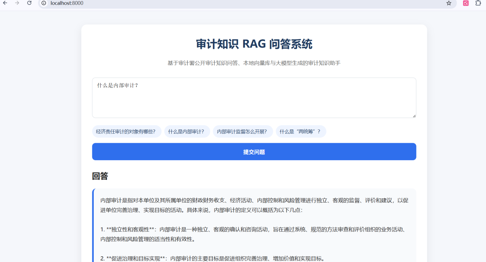

## Demo


# Audit Knowledge RAG System

一个面向审计知识问答场景的本地化 RAG 系统。系统基于审计署公开审计知识问答数据，使用 Qdrant 构建本地向量知识库，并通过 LangGraph + FastAPI + 大语言模型接口实现带来源追溯的审计知识问答。

## Features

- 审计署公开审计知识问答数据采集
- 数据清洗、去重、字段标准化
- Qdrant 本地向量数据库
- Sentence-Transformers 中文 embedding
- LangGraph RAG 工作流
- FastAPI 问答接口
- 简洁 Web 问答页面
- 回答附带原文来源、发布时间和链接
- 支持全量更新与日常增量更新
- 支持 cron 定时任务
- 可接入 OpenAI-compatible API，例如 One API、Ollama、vLLM、Xinference

## Architecture

```text
National Audit Office Website
        ↓
Crawler / Cleaner
        ↓
Embedding Model
        ↓
Qdrant Vector Database
        ↓
LangGraph RAG Workflow
        ↓
LLM API
        ↓
FastAPI + Web UI
